<p align="center"><a href="https://laravel.com" target="_blank"></a></p>

<p align="center">
<a href="https://github.com/laravel/framework/actions"></a>
<a href="https://packagist.org/packages/laravel/framework"></a>
<a href="https://packagist.org/packages/laravel/framework"></a>
<a href="https://packagist.org/packages/laravel/framework"></a>
</p>

# Compareware

Compareware es una aplicación web que utiliza **Laravel** para el frontend y vistas Blade, y **Node.js + Express** para la API backend, conectada a una base de datos **PostgreSQL**. Permite gestionar usuarios, periféricos y otros recursos, integrando autenticación JWT y operaciones CRUD desde el frontend y Postman.

## Tecnologías utilizadas

- **Laravel**: Framework PHP para el frontend y vistas Blade.
- **Node.js + Express**: Backend para la API RESTful.
- **PostgreSQL**: Base de datos relacional.
- **JWT**: Autenticación segura en la API.
- **bcryptjs**: Encriptación de contraseñas.
- **dotenv**: Gestión de variables de entorno.
- **pg**: Conexión de Node.js con PostgreSQL.

## Instalación de Composer para la creación del Proyecto Compareware

1.- Busca Composer ene el navegador de tu gusto 
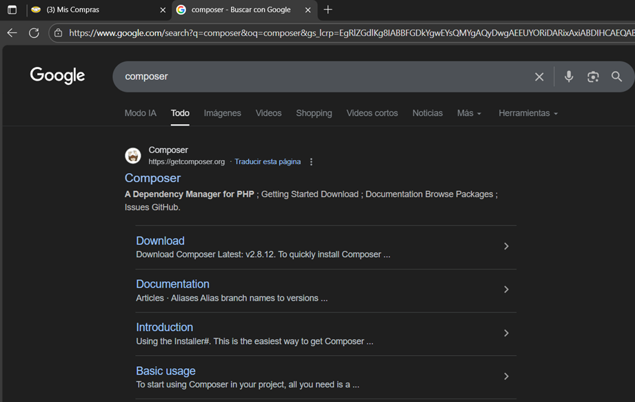
 
2. Ingresa al sitio en la pestaña de download
 
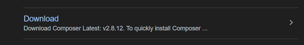

3. Descarga la versión mas reciente para tu sistema operativo (en mi caso Windows)

 
4. Instala Composer en tu unidad de preferencia (Mi caso disco c: )
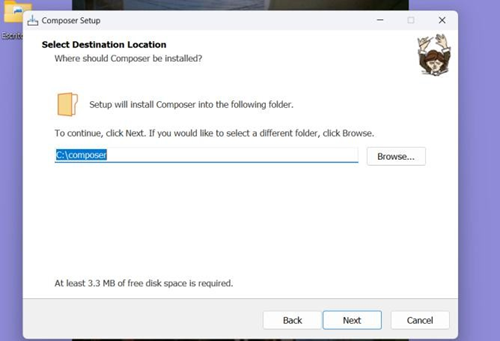
 
5.- Finaliza la instalación para posteriormente acceder al cmd y comprobar su instalación, sabemos que fue una instalación exitosa si al ingresar el comando Composer arroja la palabra composer y su versión 
 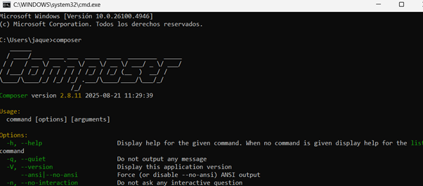


## Instalación de Laravel para la creación del proyecto Compareware

1.	Al instalar composer se nos agrega una carpeta llamada XAMPP en el disco donde seleccionamos que se instalara Composer, esta carpeta tiene carpetas mas  entre ellas la llamada htdocs en donde haremos una nueva carpeta, esta carpeta será la de nuestro poryecto y será llamada Compareware.

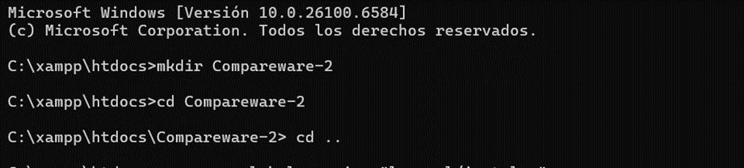
 
2.	Una vez creada la carpeta instalaremos Laravel usando el comando “composer global require laravel/insatler”
 
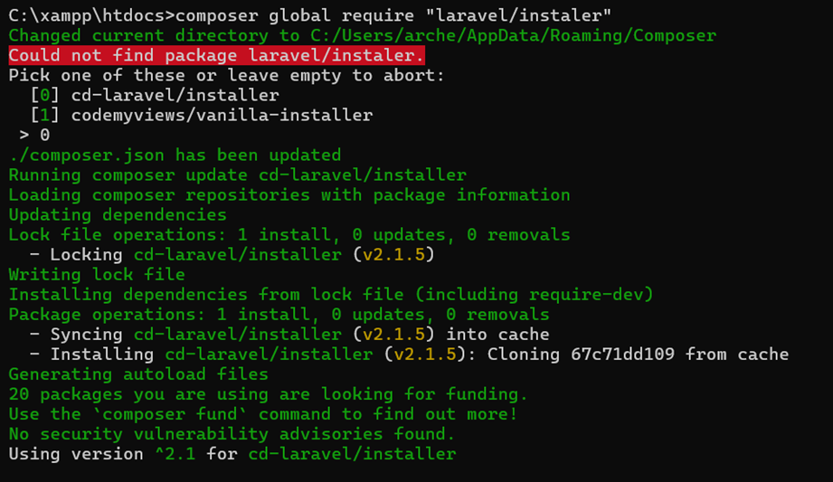

3.	 Una vez instalado laravel crearemos el proyecto compareware con el comando  composer global require "laravel/instaler", una vez ejecutado este empezara a crear todos los documentos necesarios para poder crear un proyecto basado en la arquitectura mvc.

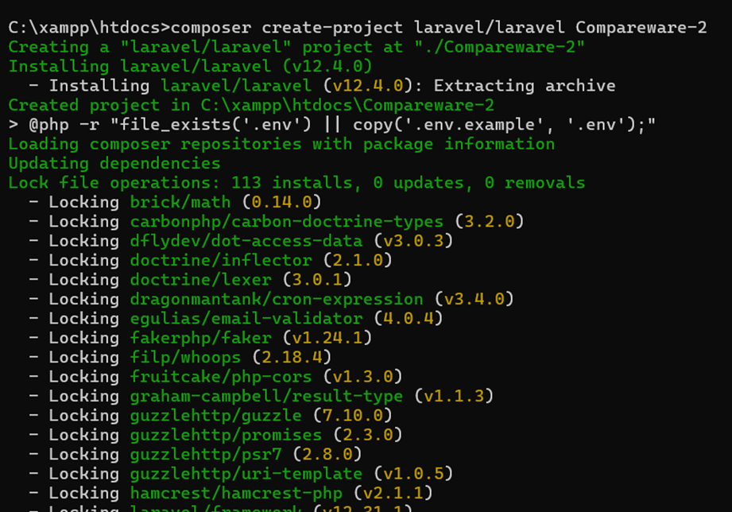

## Instalacion de Node.js para el proyecto Compareware

1-	Buscamos Node.js en nuestro navegador de confianza 
 
 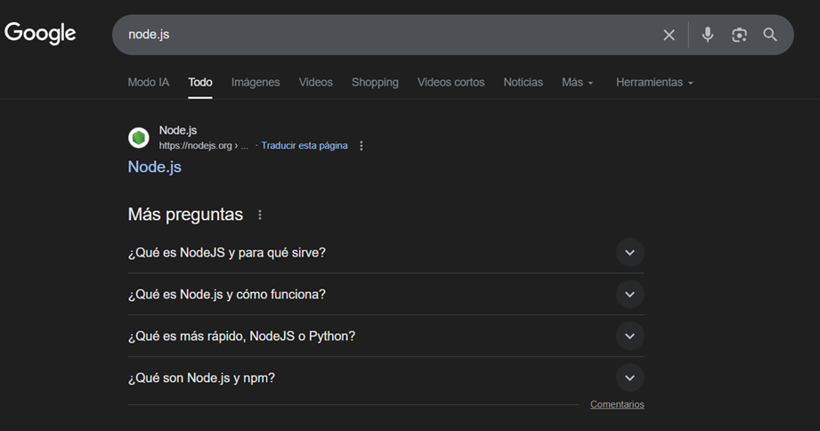

2.-  En la pestaña descarga buscamos la versión y el sistema operativo para poderlo instalar 
 
3 - Dentro de la carpeta Xampp del disco c, buscaremos la carpeta htdocs y crearemos una nueva carpeta (en mi caso llamada JavaS) esta carpeta servirá para hacer la instalación de node.js 
 
 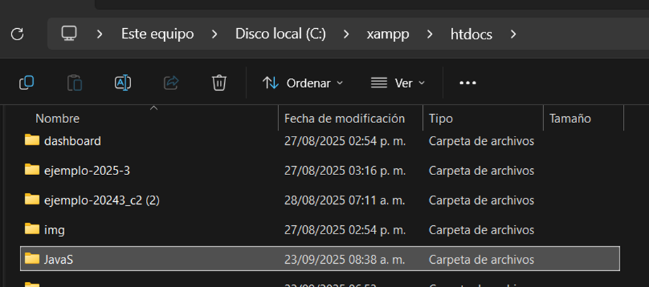

4- Abriremos la terminal en la ruta de la carpeta JavaS creada anteriormente, para posteriormente ejecutar los comandos 
mkdir api-node
cd api-node
npm init -y
npm install express cors body-parser

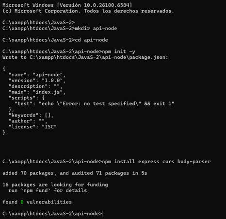
 
Una vez concluidas las instalaciones podemos empezar a codificar y diseñar nuestro proyecto, haciendo conexiones a base de datos y desarrollar el frontend y backend 😊

## BASE DE DATOS PostgreSQL en Compareware.

Es una biblioteca digital donde la información esta ordenada para que sea rápido y sencillo de buscar, añadir, actualizar o eliminar lo que se necesite.
1. Acceso a la Base de Datos
Host: 127.0.0.1
Puerto: 5432
Base de datos: Compareware
Usuario: postgres
Contraseña: 123456789

psql -h 127.0.0.1 -U postgres -d Compareware

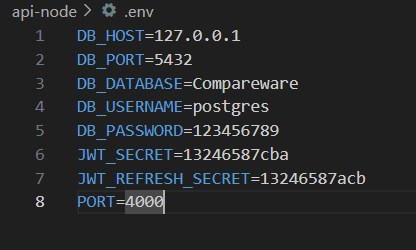

2. Estructura Principal de Tablas
perifericos
•	id (PK)
•	nombre
•	descripcion
•	precio
•	marca_id (FK)
•	categoria_id (FK)
•	created_at
•	updated_at
categorias
•	id (PK)
•	nombre
•	descripcion
•	created_at
•	updated_at
marcas
•	id (PK)
•	nombre
•	descripcion
•	created_at
•	updated_at
comentarios
•	id (PK)
•	contenido
•	usuario_id (FK)
•	periferico_id (FK)
•	created_at
•	updated_at
users
•	id (PK)
•	name
•	email
•	password
•	created_at
•	updated_at

comparaciones
•	id (PK)
•	usuario_id (FK)
•	periferico_1_id (FK)
•	periferico_2_id (FK)
•	resultado
•	created_at
•	updated_at

.png>)


3. Consultas Básicas y Avanzadas
Consultar todos los registros
SELECT * FROM perifericos;
SELECT * FROM categorias;
SELECT * FROM marcas;
SELECT * FROM comentarios;
SELECT * FROM users;
SELECT * FROM comparaciones;

Consultar con filtros
•	Periféricos de una categoría específica
SELECT * FROM perifericos WHERE categoria_id = 2;
•	Comentarios de un periférico específico
SELECT * FROM comentarios WHERE periferico_id = 5;
•	Usuarios con email específico
SELECT * FROM users WHERE email = 'usuario@correo.com';

Insertar nuevos registros
•	Nuevo periférico
INSERT INTO perifericos (nombre, descripcion, precio, marca_id, categoria_id)
VALUES ('Mouse Gamer', 'Mouse óptico RGB', 499.99, 1, 3);
•	Nueva categoría
INSERT INTO categorias (nombre, descripcion)
VALUES ('Teclados', 'Dispositivos de entrada para escribir');
•	Nuevo comentario
INSERT INTO comentarios (contenido, usuario_id, periferico_id)
VALUES ('Excelente producto', 2, 1);
Actualizar registros existentes
•	Cambiar el precio de un periférico
UPDATE perifericos
SET precio = 450.00
WHERE id = 1;
•	Actualizar la descripción de una marca
UPDATE marcas
SET descripcion = 'Marca líder en periféricos'
WHERE id = 2;

4. Administración y Seguridad
•	Realiza respaldos periódicos usando pgAdmin o el comando pg_dump.
•	No compartas las credenciales de acceso con usuarios no autorizados.
•	Usa roles y permisos en PostgreSQL para limitar el acceso a datos sensibles.
 
5. Solución de Problemas
Si no puedes conectarte, verifica que el servidor PostgreSQL esté corriendo y que los datos de acceso sean correctos.
Si tienes errores de migración, ejecuta:
php artisan migrate
Para limpiar y recrear todas las tablas:
php artisan migrate

Integración Laravel + Node.js + PostgreSQL 
1. Configuración de la API en Node.js
Se creó un proyecto Node.js con Express y las siguientes dependencias: express, cors, body-parser, pg, jsonwebtoken, bcryptjs, dotenv Se configuró la conexión a PostgreSQL usando variables de entorno en .env: 
 

Se creó el archivo principal app.js con endpoints para registro y login, usando JWT para autenticación y bcrypt para encriptar contraseñas. 
Ejemplo de registro en Node.js:
 

Ejemplo de login en Node.js:


 

Modificación de las vistas Blade en Laravel

Se actualizaron los formularios de login y registro para enviar los datos a la API Node.js usando fetch/AJAX.
Se cambió el puerto de la API a 4000 en los scripts.

 

3. Pruebas en Postman

Para registro:
URL: http://localhost:4000/api/register
Método: POST
Body (raw, JSON):

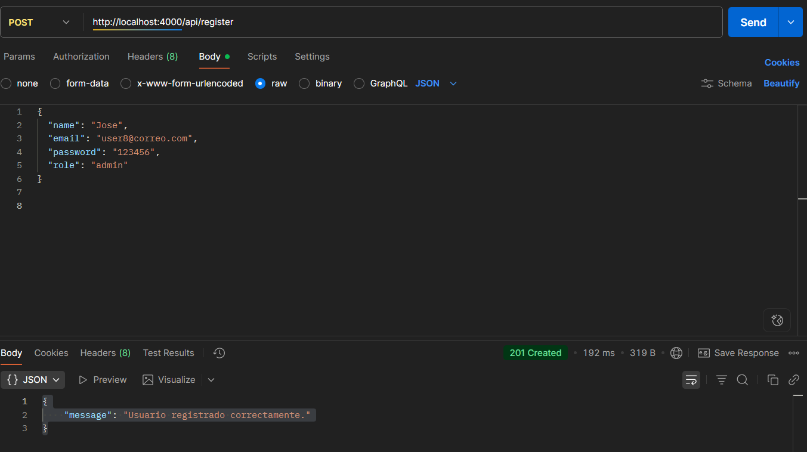

 
Para login:
URL: http://localhost:4000/api/login
Método: POST
Body (raw, JSON):

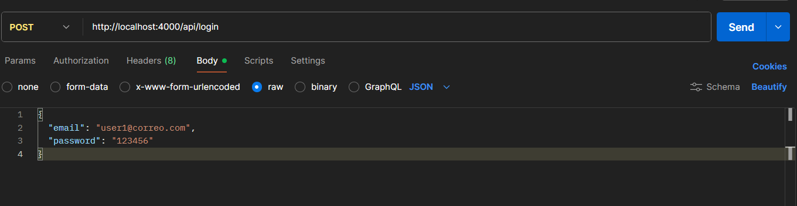

 
4. Ejecución de servidores

Node.js:
Ejecuta node app.js para iniciar la API en el puerto 4000.
Laravel:
Ejecuta php artisan serve para servir las vistas Blade.

Unidad 4 Frameworks 

1. Laravel (PHP)

¿Qué es?
Laravel es un framework de desarrollo web en PHP orientado a MVC (Modelo-Vista-Controlador).

¿Qué trabajo hace en el proyecto?
•	Sirve las vistas Blade (login.blade.php, registro.blade.php, etc.).
•	Permite organizar el frontend y la estructura de la aplicación.
•	Gestiona rutas, controladores y vistas.
Ventajas:
•	Estructura clara y organizada.
•	Blade para plantillas dinámicas.
•	Seguridad y protección CSRF.
•	Gran comunidad y documentación.
•	Fácil integración con bases de datos y otros servicios.

2. Node.js + Express (JavaScript)

¿Qué es?
Node.js es un entorno de ejecución para JavaScript en el servidor. Express es un framework minimalista para crear APIs y aplicaciones web con Node.js.

¿Qué trabajo hace en el proyecto?
•	Implementa la API REST para registro y login.
•	Conecta con la base de datos PostgreSQL para guardar y autenticar usuarios.
•	Gestiona la autenticación con JWT y el cifrado de contraseñas con bcrypt.
•	Recibe peticiones AJAX/fetch desde las vistas Blade y responde con JSON.

Ventajas:
•	Alto rendimiento y escalabilidad.
•	Fácil manejo de APIs RESTful.
•	Gran ecosistema de paquetes (npm).
•	Permite usar JavaScript tanto en frontend como en backend.
•	JWT para autenticación segura y sin estado.

3. PostgreSQL (Base de datos)

¿Qué es?
PostgreSQL es un sistema de gestión de bases de datos relacional, robusto y de código abierto.

¿Qué trabajo hace en tu proyecto?
•	Almacena los datos de las tablas 
•	Permite consultas eficientes y seguras desde Node.js.


Ventajas:
•	Muy seguro y estable.
•	Soporte para transacciones y relaciones complejas.
•	Escalable y con gran soporte para integraciones.

4. Otros paquetes y herramientas

•	JWT (jsonwebtoken): Para autenticación segura y sin estado.
•	bcryptjs: Para cifrar contraseñas antes de guardarlas en la base de datos.
•	dotenv: Para gestionar variables de entorno de forma segura.
•	cors: Permite que tu API Node.js sea consumida desde el frontend Laravel.


Instalación de Frameworks

1. Instalación de los Frameworks

1	Laravel (Frontend y Vistas Blade)
Requisitos previos:
•	PHP 8.x o superior
•	Composer
Instalación:
1.	Abre una terminal y ejecuta:
composer create-project laravel/laravel compareware
2.	Ingresa al directorio del proyecto:
cd compareware
3.	Instala dependencias adicionales si es necesario:
composer install

2. Node.js + Express (API Backend)

Requisitos previos:
•	Node.js 18.x o superior
•	Npm

Instalación:
1.	Crea una carpeta para la API:
mkdir api-node
cd api-node
2.	Inicializa el proyecto y agrega dependencias:
npm init -y
npm install express cors body-parser pg jsonwebtoken bcryptjs dotenv

3.	Crea el archivo principal app.js
 


3. PostgreSQL (Base de Datos)
 
Requisitos previos:
•	PostgreSQL instalado y corriendo
•	
Configuración:

1.	Crea una base de datos llamada Compareware.
2.	Crea la tablas que requiera el proyecto:


## 2	Estructuras de los Frameworks

Laravel

Carpetas principales:
Controllers → Controladores (ejemplo: PerifericoController.php)
views → Vistas Blade (login.blade.php, registro.blade.php)
web.php → Rutas web (vistas)
api.php → Rutas API (si usas Laravel como API)
.env → Configuración de entorno (base de datos, claves, etc.)

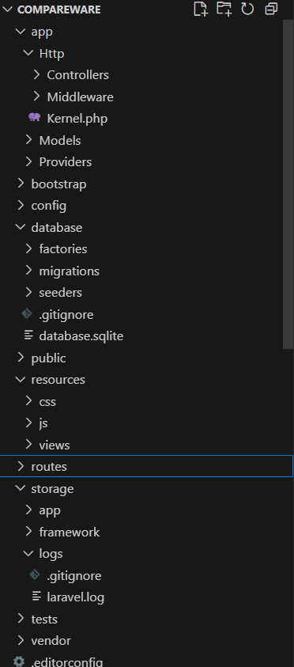
 

Node.js + Express

Archivos principales:
app.js → Lógica principal de la API
.env → Configuración de conexión a PostgreSQL y clave JWT
Carpetas recomendadas:
controllers/ → Lógica de negocio 
models/ → Modelos de datos 

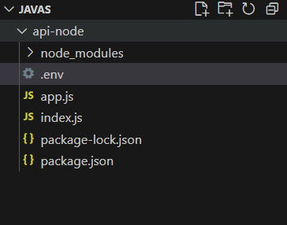

 

## 3	Conexión de la Base de Datos

Laravel

Configura el archivo .env:

 

Laravel usa estos datos para conectarse a PostgreSQL y manejar modelos y migraciones.

Node.js

Configura el archivo .env en la carpeta de la API:
 

El archivo app.js usará estas variables para conectar y operar sobre la base de datos.

## Explicacion corta de la conexion de base de datos 
https://youtu.be/vCRg0HtSITk


## ¿Por qué hay dos conexiones de base de datos en el proyecto?

1.	Laravel (PHP)

Esta conexión se utiliza para:
•	Modelos Eloquent (como Periferico)
•	Migraciones, seeders y consultas desde controladores PHP
•	Ejemplo: El controlador PerifericoController usa Eloquent para consultar y modificar datos en PostgreSQL.

2.	Node.js (JavaScript)

Esta conexión se utiliza para:
•	Registrar y autenticar usuarios
•	Realizar operaciones CRUD desde la API REST en JavaScript
•	Ejemplo: Los endpoints /api/register y /api/login insertan y consultan usuarios en PostgreSQL.

¿Por qué se usan ambas conexiones?
•	Laravel sirve las vistas y puede manejar lógica de negocio y modelos en PHP.
•	Node.js gestiona la API REST y la autenticación con JWT en JavaScript.
Ambos acceden a la misma base de datos para compartir información y mantener la coherencia de los datos.

## Ejecución

### 1. Inicia el servidor Laravel

```bash
php artisan serve
```

### 2. Inicia la API Node.js

```bash
cd api-node
node app.js
```
La API estará disponible en `http://localhost:4000`.

## Uso

### Pruebas en Postman

- **Registro de usuario**  
  POST `http://localhost:4000/api/register`
  ```json
  {
    "name": "TuNombre",
    "email": "admin@correo.com",
    "password": "123456",
    "role": "admin"
  }
  ```

- **Login de usuario**  
  POST `http://localhost:4000/api/login`
  ```json
  {
    "email": "admin@correo.com",
    "password": "123456"
  }
  ```

- **CRUD de periféricos**
  - GET `http://localhost:4000/api/perifericos`
  - POST `http://localhost:4000/api/perifericos`
  - PUT `http://localhost:4000/api/perifericos/:id`
  - DELETE `http://localhost:4000/api/perifericos/:id`

### Uso desde las vistas Blade

Los formularios de registro y login en Laravel envían los datos a la API Node.js usando AJAX/fetch, mostrando la respuesta directamente en la interfaz.

## Estructura del proyecto

- `/app/Http/Controllers` - Controladores Laravel
- `/resources/views` - Vistas Blade
- `/routes/web.php` - Rutas web (Laravel)
- `/api-node/app.js` - API Node.js
- `/api-node/.env` - Variables de entorno para Node.js

## Cambios realizados desde el inicio del proyecto hasta el último cambio

- **Inicio del proyecto:**  
  - Se creó la estructura base con Laravel y Composer.
  - Se instaló Node.js y se generó la carpeta para la API backend.
  - Se configuró PostgreSQL como base de datos principal y se crearon las tablas necesarias (`users`, `perifericos`, `categorias`, `marcas`, `comentarios`, `comparaciones`).

- **Desarrollo de la API Node.js:**  
  - Se instalaron dependencias principales (`express`, `cors`, `body-parser`, `pg`, `jsonwebtoken`, `bcryptjs`, `dotenv`).
  - Se configuró la conexión a PostgreSQL usando variables de entorno.
  - Se implementaron endpoints para registro y login de usuarios con autenticación JWT y encriptación de contraseñas.
  - Se crearon endpoints CRUD para la tabla `perifericos` y se documentó cómo hacer pruebas en Postman para cada método (GET, POST, PUT, DELETE).
  - Se agregaron ejemplos para otras tablas y se explicó cómo adaptar los endpoints para ellas.

- **Integración frontend y backend:**  
  - Se modificaron las vistas Blade (`login.blade.php`, `registro.blade.php`) para enviar datos a la API Node.js usando AJAX/fetch.
  - Se ajustaron los scripts para apuntar al puerto 4000 de la API.
  - Se mejoró la experiencia de usuario en los formularios y se agregaron enlaces entre las vistas de login y registro.
  - Se realizaron cambios en el diseño y la estructura de los formularios para mayor claridad y usabilidad.

- **Pruebas y documentación:**  
  - Se realizaron pruebas en Postman para todos los endpoints y métodos de la API.
  - Se documentó el proceso de instalación de Composer, Laravel y Node.js con imágenes paso a paso.
  - Se agregaron ejemplos de consultas SQL básicas y avanzadas para PostgreSQL.
  - Se explicó la estructura de carpetas y archivos de Laravel y Node.js.
  - Se detalló la conexión entre los frameworks y la base de datos, incluyendo el uso de archivos `.env` y la razón de tener dos conexiones activas.

- **Mejoras y seguridad:**  
  - Se recomendó el uso de roles y permisos en PostgreSQL para proteger datos sensibles.
  - Se sugirió realizar respaldos periódicos de la base de datos.
  - Se documentó la importancia de no compartir credenciales y de mantener la configuración en archivos de entorno.

- **Ampliación y escalabilidad:**  
  - Se dejó abierta la posibilidad de agregar más endpoints, tablas y funcionalidades.
  - Se explicó cómo el proyecto puede escalarse y adaptarse a nuevas necesidades, incluyendo la migración a otros frameworks de frontend si se desea.


## Descripción de carpetas y archivos principales

- `/app/Http/Controllers`  
  Controladores de Laravel para manejar la lógica del frontend y las vistas.

- `/resources/views`  
  Vistas Blade de Laravel, donde se encuentran los formularios y la interfaz de usuario.

- `/routes/web.php`  
  Archivo de rutas web de Laravel, define las rutas para las vistas y controladores PHP.

- `/routes/api.php`  
  (Opcional) Archivo de rutas API de Laravel, si se usa Laravel como API adicional.

- `/api-node/app.js`  
  Archivo principal de la API Node.js, contiene la lógica de los endpoints y la conexión a la base de datos.

- `/api-node/.env`  
  Archivo de variables de entorno para la API Node.js, define los parámetros de conexión a PostgreSQL y la clave JWT.

- `/database/migrations`  
  Migraciones de Laravel para crear y modificar tablas en la base de datos.

- `/public`  
  Archivos públicos y recursos estáticos del frontend.

## Notas y recomendaciones finales

- **Seguridad:**  
  Mantén tus archivos `.env` fuera del control de versiones y nunca compartas credenciales en público.
- **Respaldo:**  
  Realiza respaldos periódicos de la base de datos usando pgAdmin o comandos de PostgreSQL.
- **Pruebas:**  
  Utiliza Postman para probar todos los endpoints antes de poner el proyecto en producción.
- **Escalabilidad:**  
  El proyecto está preparado para crecer, puedes agregar nuevas tablas, endpoints y funcionalidades según las necesidades.

## Contribuir

Las contribuciones son bienvenidas. Por favor, revisa la documentación oficial de Laravel y Express para mejores prácticas.

## Licencia

Este proyecto está bajo la licencia MIT.